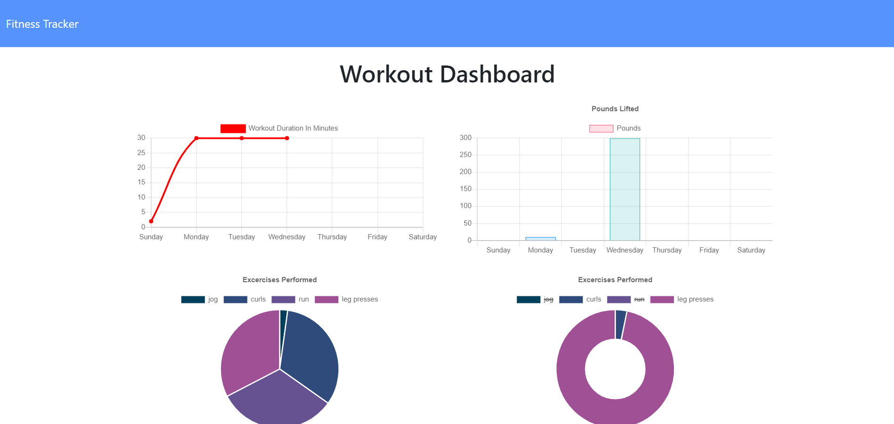

# fitness_tracker

  # README_Generator

  

  ## Description 
  Click here to [view the deployed app](https://fast-headland-69247.herokuapp.com/)
  <br>
  I built this app to keep track of the users fitness achiecments and compile a database of their most recent workouts. When the user is prompted to enter either cardio or resitance for an exercise type they are then taken to the next page where they specify which workout they did, how many reps and for how long. 

  

  Once all of the fields are filled out, the information that they provide is then appended to a series of graphs and into the workout database.

  ## Table of Contents 
  
  * [instalation](#instalation)
  * [Usage](#usage)
  * [License](#license)
  * [Contributing](#contributing)
  * [Questions](#questions)
  
  ## Installation 
  
  To install necessary dependancies, run the following command: 
  ```
  npm i
  ```
  ## Usage
  
   The intended use of this app is to keep track of your daily workout and weekly workouts.
  
  ## License
  
  This project is licensed under the MIT license 
  
  ## Contributing
  
  Please pull from the master branch and make pull requests before you attempt to contribute to this repo.
  

 ## Questions
  
 If you have any questions anout the repo, open an issue or contact me directly at [solemansay](https://github.com/solemansay/). 
 Or send me an email at solemansay@gmail.com

 ```
Thank you for viewing my fitness tracker project! I hoped you enjoyed my solution and continue to follow my career as a jr full-stack web developer. 
-Soleman Sayeed
```